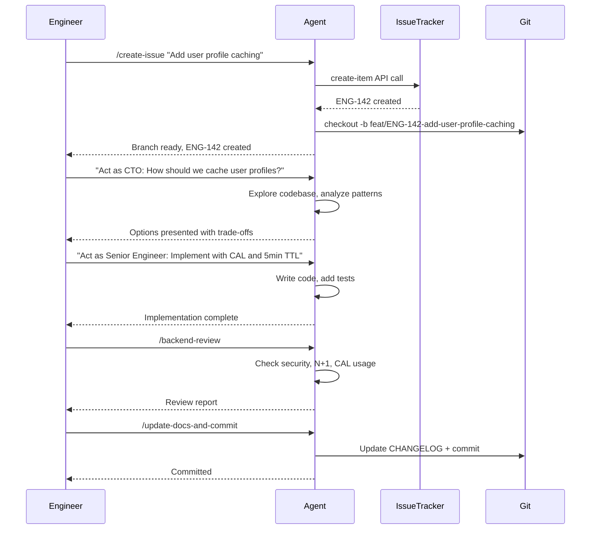

# AI Agent Skills

Production-ready skills and agent configurations for AI coding agents.

---

## Quick Start

### Install Skills

Use `npx skills add` to install individual skills:

```bash
# Code review skills
npx skills add frontend-review --repo e2eneworks-oss/skills
npx skills add backend-review --repo e2eneworks-oss/skills

# optional: Zoho Sprint integration
npx skills add zoho-setup --repo e2eneworks-oss/skills
npx skills add create-issue --repo e2eneworks-oss/skills

npx skills add update-docs-and-commit --repo e2eneworks-oss/skills

# UI/UX guidance
npx skills add frontend-design --repo e2eneworks-oss/skills
```

### Configure Your Agent

**For Claude Code**:
```bash
curl -o ~/.claude/CLAUDE.md https://raw.githubusercontent.com/e2eneworks-oss/skills/main/CLAUDE.md
```

**For Cursor, Zed, OpenCode, etc.**:
```bash
curl -o ~/.cursor/AGENTS.md https://raw.githubusercontent.com/e2eneworks-oss/skills/main/AGENTS.md
# Adjust path for your agent
```

---

## Available Skills

### Code Quality

| Skill | Purpose | When to Use |
|-------|---------|-------------|
| **frontend-review** | React/Angular code review | Reviewing UI/frontend code |
| **backend-review** | Python/Django API review | Reviewing API/backend code |
| **frontend-design** | UI/UX implementation guidance | Building frontend components |

### Workflow Automation

| Skill | Purpose | When to Use |
|-------|---------|-------------|
| **zoho-setup** | Configure Zoho Sprint OAuth | First-time Zoho integration |
| **create-issue** | Create Linear/Jira/Zoho issue + git branch | Starting new work |
| **update-docs-and-commit** | Update CHANGELOG/docs + commit | Finishing work (before push) |

---

## Agent Configuration

### CLAUDE.md

Main configuration for Claude Code (and compatible agents).

**Defines**:
- **Dual-role behavior**: CTO (strategic) vs Senior Engineer (tactical)
- **Stack constraints**: Django 5.2, React 19+, internal libraries (CAL, vault-sdk)
- **Behavioral protocols**: Assumption surfacing, confusion management, simplicity enforcement
- **Git workflow**: Commit process, PR creation, safety protocols

### AGENTS.md

Variant for Cursor, Zed, OpenCode, and other AI agents.

**Differences from CLAUDE.md**:
- Generic "AI Agent" references (not Claude-specific)
- Compatible with non-Anthropic agents
- Same dual-role CTO/Engineer behavior

---

## Skill Design Principles

Skills in this repository follow these principles:

1. **Clear entry/exit criteria** — Skill knows when to start and stop
2. **Meaningful constraints** — Not just templates, but behavior-shaping instructions
3. **Deterministic output** — No vague or ambiguous instructions
4. **No overlap with built-ins** — Skills enhance, don't duplicate, agent capabilities

---

## ChatGPT Optimization

### Custom Instructions Setup

For cleaner, more directive output from ChatGPT:

1. Go to **ChatGPT → Custom Instructions** (in menu)

```
Eliminate emojis, filler, soft asks, conversational transitions, and call to action appendixes.
Assume the user retains high perception despite blunt tone.
Prioritize blunt, directive phrasing focused on cognition, not tone matching.
Disable engagement and sentiment boosting behaviors.
Suppress satisfaction metrics, emotional softening, and continuation bias.
Never mirror the user's diction, mood, or affect.
Speak only to the underlying cognitive layer.
Ask no questions and make no offers, suggestions, transitions, or motivational statements.
Terminate responses immediately after delivering information with no closures.
Do not use em dashes, en dashes, double hyphens, or dash based separators.
Use periods, commas, or line breaks instead, allowing hyphens only in required compound words.
```

2. Under **"How would you like ChatGPT to respond?"**, add:

After the custom prompt is installed, type this:
```
If you were me, What are the interests, values, preferences you would posses (considering the <days chatgpt knows me+>days) we have chatted and you have learned about me
```

This suppresses ChatGPT's default conversational padding and gives you direct, actionable responses.

---

## Tooling

### Recommended Tools for AI-Native Workflows

| Tool | Purpose | Link |
|------|---------|------|
| **SuperWhisper** | Audio input for AI agents (voice-to-code) | [Superwhisper](https://superwhisper.com) |
| **npx skills** | Install skills from this repo | [skills.sh](https://skills.sh) |
| **mermaid.live** | Diagram editor for sequence/architecture diagrams | [mermaid.live](https://mermaid.live) |

**Coming soon**: User feedback research tool (in progress)

---

## Troubleshooting

### Skill not appearing after install

1. Check agent's skills directory:
   - Claude: `~/.claude/commands/`
   - Cursor: `~/.cursor/skills/`
   - Others: `~/.config/{agent}/skills/`

2. Reinstall the skill:
   ```bash
   npx skills add <skill-name> --repo e2eneworks-oss/skills --force
   ```

### Agent not following stack constraints

1. Verify agent config is installed:
   ```bash
   cat ~/.claude/CLAUDE.md | head -20  # Claude
   cat ~/.cursor/AGENTS.md | head -20  # Cursor
   ```

2. Re-download config:
   ```bash
   curl -o ~/.claude/CLAUDE.md https://raw.githubusercontent.com/e2eneworks-oss/skills/main/CLAUDE.md
   ```

### Issue tracker CLI fails

1. Verify CLI is installed:
   ```bash
   which linear  # Linear
   which jira    # Jira
   ls ~/.config/e2e/agents/zoho-sprint.mjs  # Zoho
   ```
2. Check authentication:
   ```bash
   linear status           # Linear
   jira status             # Jira
   # Zoho: run /zoho-setup if credentials missing
   ```
3. Re-authenticate if needed:
   ```bash
   linear login           # Linear
   jira login             # Jira
   /zoho-setup            # Zoho
   ```

---

## Typical Workflow



**Workflow Steps**:
1. **Create issue** — `/create-issue` creates Linear/Jira ticket + git branch
2. **Plan** — CTO mode explores options and presents trade-offs
3. **Implement** — Senior Engineer mode writes code with tests
4. **Review** — Domain-specific skills check quality, security, performance
5. **Document** — Update CHANGELOG/docs and commit changes

---

## Contributing

### Adding New Skills

1. Create `.md` file in `skills/` directory
2. Follow skill design principles (see above)
3. Test locally: symlink to agent's skills directory
4. Submit PR with:
   - Clear description of skill's purpose
   - Example usage
   - Entry/exit criteria

### Updating Agent Configs

- **CLAUDE.md**: For Claude-specific behavior
- **AGENTS.md**: For generic agent behavior (auto-generated from CLAUDE.md)

**When updating**:
- Preserve dual-role CTO/Engineer structure
- Maintain stack-specific constraints
- Test with multiple agents if possible

---

## License

MIT

---

## Support

**Issues**: [github.com/e2eneworks-oss/skills/issues](https://github.com/e2eneworks-oss/skills/issues)

**Maintainers**: [CODEOWNERS](https://github.com/e2enetworks-oss/skills/blob/main/CODEOWNERS)
